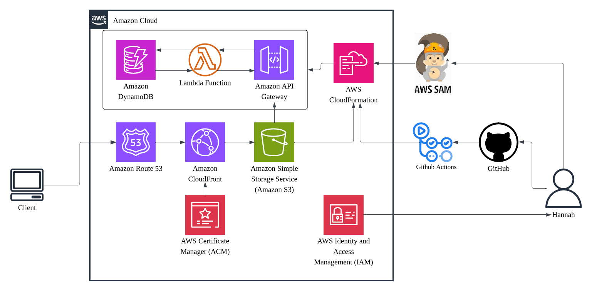

# ☁️ Cloud Resume Challenge: Full-Stack Serverless Architecture  

An end-to-end serverless web application and visitor counter built on AWS using Infrastructure as Code (IaC) and automated GitOps CI/CD.  

🔗 Live Demo: [iohannah.com](iohannah.com)  
🔗 Technical Article: [Read the technical deep-dive on how i built this project.](https://medium.com/@hannahleung.work/building-my-cloud-resume-my-hands-on-adventure-with-aws-0b2a4436955f)  

## :rocket: Architecture Overview  

This project follows a 100% serverless approach to ensure scalability and cost-efficiency:  

**Frontend:** HTML/CSS/JS hosted on S3 and delivered via CloudFront (CDN) with ACM SSL/TLS.  
**DNS:** Managed via Route 53.  
**Backend:** REST API built with API Gateway and AWS Lambda (Python).  
**Database:** DynamoDB (NoSQL) for global state management.  
**Infrastructure:** Defined via AWS SAM and CloudFormation.  
**CI/CD:** Automated testing and deployment pipelines via GitHub Actions.  

## :gear: The Tech Stack  

**Cloud Provider:**	AWS (S3, CloudFront, Lambda, DynamoDB, API Gateway, Route 53, IAM)  
**IaC:**	AWS SAM, CloudFormation  
**DevOps:**	GitHub Actions (OIDC), Git, Pytest  
**Environment:**	Linux (Arch)  
**Languages:**	Python (Backend), JavaScript (Frontend), YAML (Workflow/IaC)  

## :bulb: Key Features & Challenges  
* Infrastructure as Code (IaC)  
The entire backend stack-including IAM roles, DynamoDB tables, and API Gateway resources is defined in a single template.yaml file. 
* Security & Least Privilege  
      - Principle of Least Privilege with AWS IAM policies 
      - Configured GitHub OIDC for secure, passwordless authentication between GitHub and AWS.  
      - Secured traffic with HTTPS using CloudFront and ACM.  
* Automated Testing & Deployment  
      - **Unit Testing:** Used Pytest with the moto library to mock AWS services, ensuring the Lambda function logic is validated before deployment.  
      - **CI/CD:** GitHub Actions triggers on every push to main, running tests and deploying changes to AWS automatically.  
* Troubleshooting Highlights  
      - **The DynamoDB 502:** Discovered a 502 error was caused by using "count" (a reserved word) in DynamoDB. Resolved by monitoring CloudWatch Logs and implementing a data analysis approach.  
      - **OIDC Permissions:** Fixed "missing permission" errors by explicitly granting id-token permissions in the GitHub Actions workflow file.  

## :package: Prerequisites  
* [AWS CLI](https://docs.aws.amazon.com) configured with Administrator permissions.  
* [AWS SAM CLI](https://docs.aws.amazon.com) installed.  
* Python 3.11 or later.  

## :hammer_and_wrench: Key Configurations
### Deploy the sample application  

The Serverless Application Model Command Line Interface (SAM CLI) is an extension of the AWS CLI that adds functionality for building and testing Lambda applications. It uses Docker to run your functions in an Amazon Linux environment that matches Lambda. It can also emulate your application's build environment and API.  

To build and deploy your application for the first time, run the following in your shell:  

```bash
sam build --use-container
sam deploy --guided
```

The first command will build the source of your application. The second command will package and deploy your application to AWS, with a series of prompts:  

* **Stack Name**: The name of the stack to deploy to CloudFormation. This should be unique to your account and region, and a good starting point would be something matching your project name.  
* **AWS Region**: The AWS region you want to deploy your app to.  
* **Confirm changes before deploy**: If set to yes, any change sets will be shown to you before execution for manual review. If set to no, the AWS SAM CLI will automatically deploy application changes.  
* **Allow SAM CLI IAM role creation**: Many AWS SAM templates, including this example, create AWS IAM roles required for the AWS Lambda function(s) included to access AWS services. By default, these are scoped down to minimum required permissions. To deploy an AWS CloudFormation stack which creates or modifies IAM roles, the `CAPABILITY_IAM` value for `capabilities` must be provided. If permission isn't provided through this prompt, to deploy this example you must explicitly pass `--capabilities CAPABILITY_IAM` to the `sam deploy` command.  
* **Save arguments to samconfig.toml**: If set to yes, your choices will be saved to a configuration file inside the project, so that in the future you can just re-run `sam deploy` without parameters to deploy changes to your application.  

 
